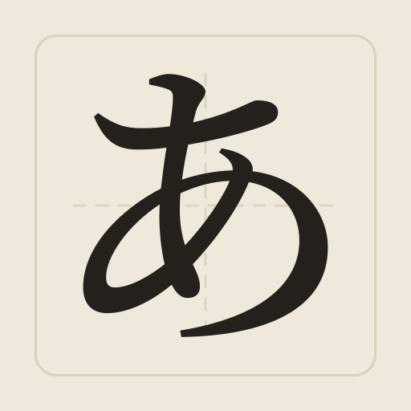

#  かな — Kana Practice

A Japanese kana recognition drill for hiragana and katakana. Open it, pick a deck, answer until
the deck is done. The app itself is four static files and a folder of fonts, with no build step
and no dependencies, and works on its own with nothing installed.

There is also an optional server. Run it and you get accounts — so your settings and records
follow you between devices — and a progress report that tells you which characters you're actually
slow on. Skip it and nothing is missing except those two things; your data stays in your browser.

## Running it

It has to be served over HTTP. Browsers block `fetch()` on `file://` pages, so double-clicking
`index.html` shows a load error instead of the app.

**With accounts and the progress report:**

```bash
./start.sh
```

That is the whole setup. It creates the virtualenv, installs the three dependencies, pulls the
latest commit if the checkout is clean, and serves everything on <http://localhost:5556>. Run it
again any time — it only reinstalls when the requirements actually changed, and only pulls when
you have no local edits. `--port 9000`, `--no-pull` and `--reload` are there if you need them.

**It listens on your network, not just this machine,** so you can open it on your phone — which is
the only place the flick drills appear. On start-up it prints the address to use, something like
`http://192.168.1.30:5556`; type that into the phone's browser with both devices on the same
Wi-Fi. The trade-off is that anything else on that network can reach it too, over plain HTTP, so
it belongs on a home network rather than a café one. `--host 127.0.0.1` keeps it to this machine.

Repeated wrong passwords are throttled, so guessing at one is slow; getting your own password
right clears the count, so normal use is never affected even after a few fumbled tries.

**Without a backend**, the app is still four static files and works on its own:

```bash
python -m http.server 8000
```

Any static file server works, and the folder can be dropped straight onto GitHub Pages, Netlify or
similar. The account and progress buttons simply don't appear; everything else is identical and
your records live in the browser as before.

The Japanese faces come with the app, so nothing needs installing and nothing is fetched from
Google or anyone else — it works with no internet connection at all. See **Character font** below.

## The drill

**Five seal stamps at the top of the menu**: あ hiragana, ア katakana, あア Kana for the decks that
are both scripts at once, 十 Numbers for counting, and 日時 Time for weekdays, months, dates and
the clock. The first three show four decks each; the last two are described further down.

Under あ and ア, the same three tiers plus a mix of them:

| Deck | Cards | What's in it |
|---|---|---|
| Base | 46 | the gojūon — あ か さ た な は ま や ら わ ん |
| Dakuten | 25 | voiced and semi-voiced — が ざ だ ば ぱ |
| Combination | 36 | yōon, the contracted sounds — きゃ しゅ ちょ |
| **Mixed hiragana** / **Mixed katakana** | 107 | all three of the above, interleaved |

Obsolete kana (ゐ ゑ ヰ ヱ and the archaic forms) are left out on purpose — you will not meet them
in modern Japanese.

Under **Kana**, the same tiers again but across both scripts at once — this is where you find out
whether you actually know シ from ツ *and* し from つ:

| Deck | Cards | What's in it |
|---|---|---|
| Kana | 92 | both base decks — か and カ side by side |
| Dakuten kana | 50 | both dakuten decks |
| Combination kana | 72 | both yōon decks |
| Mixed kana | 214 | everything in the app, in one run |

None of these is a plain shuffle. Shuffling a pile of cards together deals visible clumps — eight
yōon in a row, then a long stretch of katakana — and a clump is just the deck it came from arriving
again, which is the one thing a mixed run shouldn't do. Instead each source deck is shuffled on its
own and they're dealt out together, never more than two cards in a row from the same one. You still
see every character exactly once; only the order changes.

One difference in **Writing** on the Kana stamp: since か and カ are both "ka", those decks say
which script they want ("Write the katakana for this sound") and take only that one. Anything
inside a single script — Mixed hiragana included — has nothing to disambiguate, so the prompt is
unchanged.

Every deck keeps its own records and its own progress report, including the derived ones. A run of
Mixed kana is not a run of the six decks it's built from, and doesn't count towards them.

**Three ways to answer**, switchable under **Options**:

- **Typing** — the character is shown, you type its sound. Alternate romanisations are accepted,
  so `si`, `shi`, `hu`, `fu`, `sya`, `sha` and `nn` all count.
- **Choosing** — the character is shown, you pick its sound from four options. The default on
  phones, where typing is slow.
- **Writing** — the *sound* is shown and you type the character. This is the one that builds
  familiarity with a Japanese keyboard, so it needs an IME: switch to the Japanese keyboard on a
  phone, or a Japanese input method on a desktop. Both readings of an ambiguous sound are
  accepted — `ji` takes じ or ぢ, `zu` takes ず or づ.

**Numbers — the 十 stamp.** Counting has a seal stamp of its own, beside あ, ア and あア, holding
three drills and a reference table. It isn't kana, so it gets its own colour (a deep teal) and its
own records — but it uses the same three answer modes the decks do, and **the mode is what decides
which way round you're asked**:

- **Typing** shows **六** and you type **6**. The box is a number pad.
- **Choosing** shows **六** and you pick **6** from four numbers. The wrong three are the same
  number with a digit changed or swapped, so the answer isn't obvious from its length.
- **Writing** shows **6** and you type **ろく** — or `roku`, if you haven't got a Japanese
  keyboard set up. Both count, and the hint under the box says so. (Kana decks are stricter: there
  Writing shows you the reading, so romaji would just be typing the question back.)

**Numbers & dates ask with · Kanji / Reading** in Options decides what the first two show: the
kanji — 六, 十二, 一万二千三百四十五 — which is what you meet on a price tag or a form, or the
reading — `roku`, `jū ni` — which is what you hear at a till. Both are worth practising and neither
stands in for the other, so each keeps its own best score and time. Writing ignores the setting: it
asks with **6** either way. Whichever way you were asked, the answer tells you all three:
**六 is 6 — ろく "roku"**.

So the direction is yours to choose and it stays put for the whole run — switch mode in Options to
practise the other way.

- **Numbers 1–10** is the ten words everything else is built from. Start here.
- **Numbers 1–50** is every value once, 50 prompts — 11–50 are the pattern (`nijū` = 2×10,
  `nijū ichi` = 2×10+1) rather than fifty new words.
- **Random numbers** deals 20 drawn from 1 to 1,000,000, spread deliberately across magnitudes so a
  run isn't twenty six-digit numbers. This is where 百 千 万 and the sound changes show up.
- **Arithmetic** reads a sum aloud — 三たす四, `san tasu yon` — and asks for the answer: 7. Plus
  (たす), minus (ひく), times (かける), divide (わる) and percent, four of each in a run of 20.
  Writing shows `3 + 4` and wants how it is said, さんたすよん; プラス and マイナス count too.
  Percent comes after its number and joins with の — 25% of 200 is 二百の二十五パーセント — and 十
  before パ closes up: 10% is じゅっパーセント (or じっパーセント).

In the table, readings are shown with the parts spaced apart — `ichiman nisen sanbyaku yonjū go`
for 12,345, which is 一万 二千 三百 四十 五 — because seeing the structure is the whole lesson.
Commas in a digit answer aren't graded, so `1,000,000` and `1000000` both count. Where a number has
more than one reading, Writing takes any of them: 4 is よん, し or よ, 7 is なな or しち, 9 is
きゅう or く. The sound changes are not optional, though, because they're the point — 300 is
`sanbyaku`, 600 `roppyaku`, 800 `happyaku`, 3,000 `sanzen`, 8,000 `hassen`.

Each drill keeps its own best score and time, separate from the decks and from each other.

**All characters → 十** is the counting table, next to the two kana ones: 1–10, the second readings
of 4, 7 and 9, how 十 works either side of a digit, the places (10, 100, 1,000, 10,000, 1,000,000),
the five sound changes that break the pattern — 300 さんびゃく, 600 ろっぴゃく, 800 はっぴゃく,
3,000 さんぜん, 8,000 はっせん — and then whole numbers taken apart, up to
`一万二千三百四十五 いちまんにせんさんびゃくよんじゅうご`. Every row is the kanji, what it is, the
kana and the reading. Below those, the operator words, 十 before パーセント, and a dozen sums read
aloud.

**Time — the 日時 stamp.** Weekdays, months, dates and the clock, in seven drills with a table of
their own. Most of it is counting with something on the end — 四月 is month four, 二十日 the
twentieth, 四時 four o'clock — so it reads the same way round as the numbers:

- **Typing** shows **月曜日** and you type **Monday**; **二十日** and you type **20** — or
  `getsuyōbi` and `hatsuka`, if the Options setting above is on Reading.
- **Choosing** is the same question with four options — the dates either side of the right one, or
  the rest of the week.
- **Writing** shows **20日** and you type **はつか**; **Monday** and you type **げつようび**;
  **3:45** and you type **さんじよんじゅうごふん**. Romaji counts here too — `hatsuka`,
  `getsuyōbi` — spelt however you like: `juuni`, `jūni` and `juni` are all the same answer.

- **Weekdays** is the seven, each ending in ようび with the day's kanji in front: 月 moon, 火 fire,
  水 water, 木 wood, 金 gold, 土 earth, 日 sun. Since every one of them ends the same way, Writing
  takes just the part in front — **か** or `ka` for 火曜日 — as well as the whole **かようび**.
- **Months** is 一月 to 十二月, which are just the numbers plus がつ — except **四月 しがつ**,
  **七月 しちがつ** and **九月 くがつ**, which never take よん, なな or きゅう.
- **Days of the month** is the hard one. 一日 to 十日 have native readings that are nothing like the
  numbers — ついたち, ふつか, みっか, よっか, いつか, むいか, なのか, ようか, ここのか, とおか —
  and **二十日 は はつか**. 十四日 and 二十四日 keep よっか. The rest are the number plus にち.
- **Native dates** is those thirteen on their own — 一日 to 十日, 十四日, 二十日, 二十四日, the ones
  that are said as words instead of ending in にち. Same prompts, same grading, same three answer
  modes as the full month; it just stops asking you the eighteen you already know how to count.
- **Hours** is 一時 to 十二時 — the number plus じ, with the 4/7/9 problem one more time: **四時
  よじ**, **七時 しちじ**, **九時 くじ**.
- **Minutes** is where 分 changes shape. It is ふん after 2, 5 and 7 and ぷん after the rest, and
  the number in front changes with it: 一分 **いっぷん**, 六分 **ろっぷん**, 八分 **はっぷん**,
  十分 **じゅっぷん**. The drill asks 1 to 10 and then every five, which is how a clock is read.
- **Clock times** puts the two together: 三時四十五分 is **さんじよんじゅうごふん**, the hour and
  then the minute. Twenty faces a run, dealt so that every hour comes up. Half past has a word of
  its own — 三時半 **さんじはん** — and Writing takes either that or the long way round. Typing
  takes **3:45**, or just **345**, so the phone keypad can answer it.

**All characters → 日時** lays all of that out: the week, the twelve months, the three that change,
days 1–10, days 11–31, the three that stay native, the twelve hours, the minutes, and a handful of
whole times taken apart.

**Flick keyboard drills — phones and tablets only.** Below the deck list, on a touch device, are two
drills for the Japanese phone keyboard itself, which has ten keys — one per gojūon row — where the
vowel comes from the direction you swipe: middle **a**, left **i**, up **u**, right **e**, down
**o**. Each drill is 20 prompts and needs the Japanese keyboard. They don't appear on a desktop:
there's no flicking to practise with a physical keyboard.

- **Flick directions** shows a vowel — A, I, U, E or O — and takes *any* character with that
  vowel. Prompted with O, everything from お to こ そ と の ほ も よ ろ counts; つ counts for U and
  め for E. Only the ending matters, so you're practising the swipe, not recalling a character.
- **Flick keys** is the reverse: it shows a key — A, K, S, T, N, H, M, Y, R, W — and takes any
  character from that row, so K takes か き く け こ. Voiced characters live on their base key, so
  が also counts for K, and ぱ for H. The keys are named for the row, not for how the characters
  are spelt in romaji, which is the point: ふ is on **H** even though it's written "fu", し is on
  **S** despite "shi", and ち and つ are on **T**.

Each drill keeps its own best score and time, separate from the decks and from each other. ん
isn't drilled: it has no vowel, and which key it sits on varies between keyboards.

**Performance · Normal / Fast** in Options turns every animation off. The 〇 stamp goes with them,
so a right answer moves straight to the next character instead of pausing for it — which makes a
run noticeably quicker as well as cheaper to draw on an older phone. A wrong answer is unchanged:
it still stops, still tells you what the answer was, and still waits for you.

Fast runs count for records like any other run — same accuracy records, same fastest-run records,
one pool. Worth knowing: because Fast skips about 0.6 s per card, it finishes half a minute ahead
of the same run at the normal pace on a 50-card deck, so once you've set a time in Fast it's
usually a Fast run that beats it.

The setting stays on this device and is never synced to an account, the same as the theme. If your
system is already set to reduce motion, the app has always honoured that on its own.

In the two typing modes the answer box takes focus on every card, so you can type straight through
a deck without tapping it again each time. On a phone the keyboard stays up for the whole run —
tapping Check, Reveal or the character to continue won't dismiss it. If you close it yourself it
stays closed until you tap the box again. Reveal is always available and counts as a miss — on a
phone it sits above the character, clear of the on-screen keyboard, and under the answer box
everywhere else. Anything you got wrong is listed at the end and can be drilled on its own.

**Records are kept separately for each mode.** Recognising a character, picking it from four
options, and writing it from its sound are three different skills, so each deck keeps a separate
best score and best time per mode — a Choosing run can't set the bar for your Writing runs. The
figures on the menu are for whichever mode is selected, and they're labelled with it; switching
mode switches the numbers.

A time is only recorded for a run with no mistakes at all, so a rushed or revealed-answer run
can't set a record that's impossible to beat honestly. The run is timed the whole way through and
the clock is deliberately never shown while you're practising; a ticking counter turns practice
into a race. Missed drills don't count towards records.

**The menu stays out of the way.** It is the script switch, the list of decks, and one **Options**
button — everything else (answer mode, font, the chart, progress, account) is behind that button,
so the deck list keeps the screen instead of losing a third of a phone to stacked settings. The
Options button shows the current answer mode, since that's the one setting worth seeing at a
glance, and the deck rows are labelled with it too. Options, the font picker and the chart are
screens rather than pop-ups, so nothing is ever half a panel with the way out below the fold.

**On a wide screen the menu becomes a rail.** From about 1100px the deck list stays put on the
left and whatever you're doing — a drill, the chart, Options, your progress — fills the space
beside it, with the writing square and the answer box side by side instead of stacked. When
nothing is running the chart sits in that space, so the table you'd look a character up in is
already open. Phones and tablets are untouched: one screen at a time, exactly as before.

**Reference chart.** "All characters & romaji" opens the full gojūon tables, laid out the standard
way, including the extended katakana (ファ ティ ヴァ …) that are reference-only.

**Character font.** Kana look quite different across faces, and recognising あ in only one of them
isn't recognising あ. Five Japanese faces ship with the app, so everyone gets the same five
wherever they open it:

| Style | Face | What it's for |
|---|---|---|
| Mincho 明朝 | Noto Serif JP | serif — books, newspapers, print |
| Gothic ゴシック | Noto Sans JP | sans-serif — signs, screens, manga |
| Textbook 教科書体 | Klee One | follows handwritten stroke shapes |
| Rounded 丸ゴシック | Zen Maru Gothic | soft, rounded strokes |
| High legibility UDフォント | BIZ UDPGothic | drawn for clarity at small sizes |

They used to come from whatever your device had installed, which meant Windows showed barely half
the list — it ships no Japanese serif or textbook face unless the *Japanese Supplemental Fonts*
optional feature is added, and this is an app about what a character looks like.

They're cut down to the characters this app actually draws, so each is 32–110 KB instead of the
3.6–13 MB the full faces weigh, and only the one you've picked is ever loaded. Nothing is fetched
from Google: the files are in `fonts/`, served by whatever is serving the app, so it all works
offline. All five are under the SIL Open Font License 1.1 — `fonts/LICENSES.txt` has the full
text, and `fonts/subset.py` regenerates them.

Beyond those five, any Japanese faces your own device has are still offered — a monospaced option
if it has one, and its default serif and sans. Those are detected by rendering each candidate to a
canvas and comparing the pixels, so anything missing, or identical to an option already listed, is
left out. Your own faces also fill in for anything the bundled subsets leave out, such as a kanji
typed into the answer box by mistake.

**Light and dark.** Under **Options → Theme**: Auto follows your system and is the default, or pin
Light or Dark. The dark theme is the same washi paper at night rather than an inversion — sumi
ground, warm off-white ink, the seal red opened up to where it reads on a dark ground. Because the
app ships its own, it asks Dark Reader to leave the page alone.

The theme is the one setting that **never syncs**, even with an account. Which theme is right is a
fact about the device in front of you — a phone in bed, a laptop under office lights — so each one
keeps its own. Everything else follows you.

Signed out, everything lives in your own browser's storage and nowhere else. Clearing site data
resets it.

## Accounts and the progress report

Signing up is a username and a password, and the only thing an account does is hold your data
server-side so it follows you between devices instead of living in one browser. The local copy
stays as an offline cache, so the app keeps working signed out — an account outranks localStorage
rather than replacing it. You can delete the account, and everything stored with it, from the
account screen.

**Changing your password** is on that screen too: current password, new password, and the new one
again. It's a change, not a reset — there's no email on file and no recovery link, so knowing the
current password is the only way in, and asking for it is what stops someone who finds your phone
unlocked from taking the account. Changing it signs you out everywhere else; the device you changed
it on stays signed in.

**Your progress** is kept per deck. Phone or desktop sits at the very top — you set that once —
and under it the same stamps as the menu, which stay stuck to the top as the
report scrolls so you can switch scripts without scrolling back up. It opens on whichever script
the menu is showing, so practising katakana and then checking your progress lands on katakana.
Switching the stamps in here only changes what you're reading; the menu stays where you left it. The decks for that script
follow, unless there's only one, in which case there's nothing to pick and the heading says which
it is. Pick a deck and you get that deck's runs — mode, score and time — from the very first one. Below that, once there's enough of them, it works out
where the effort actually is: which characters you hesitate on, which are already automatic, which
you get wrong, and what you reach for instead — つ answered as た, say. Each run is listed with the
time and date you finished it and its exact length down to the millisecond, so two attempts at the
same deck are actually comparable. The analysis is deliberately cautious about what counts as data:

- **Which characters are slow, fast, or mixed up is read from your last five runs**, not from
  everything you've ever done. It's meant to tell you what to practise next, and a character you
  struggled with in your first week and have long since fixed would otherwise sit at the top of
  that list forever. Your overall accuracy, typical time and characters seen still cover every
  run — that's the long view, and it's the point of them. Least accurate stays on all your runs
  too: over five runs a character comes up five times, so one slip would read as a collapse.
- **Each deck is its own dataset.** Katakana tells you nothing about hiragana, and the base gojūon
  tells you nothing about dakuten or yōon — they're separate material. Nothing is ever averaged
  across decks, and three hiragana runs won't unlock the dakuten breakdown. The mixed and Kana
  decks are decks like any other here: each has its own figures, drawn only from runs of it, and
  each needs its own three runs before they appear. That's twelve reports to fill, not six.
- **Three complete runs of that deck before it draws any conclusions.** One run can't tell a bad
  day from a weak character, so until then there's no breakdown — only your runs, which are simply
  what happened.
- **Flick drills are listed but not analysed.** They ask for a direction or a key, and any
  character with that vowel or on that key counts — so there's no character to call slow, and a
  wrong answer can't be traced back to one. You still see every flick run you've done.
- **Anything over 10 seconds on a card is not a time.** That's you looking away, not you thinking,
  so it's dropped from the speed figures. It still counts against accuracy — you did answer it.
- **Revealed answers are never timed** either, for the same reason.
- **Drills don't appear at all.** A drill re-tests what the results screen just showed you, on the
  cards you already know you're weak at — neither its speed nor its accuracy describes how you're
  doing, and a short high score sitting in the history beside a full run just muddies it. They're
  still recorded, they're simply not shown.
- **Phone and desktop are kept apart.** Typing romaji on a keyboard and flicking on glass aren't
  comparable, so each has its own figures and you pick which to look at.

Times are reported as medians rather than averages, so one slow card doesn't move the number.

## Layout

```
index.html         nine screens, no modals
styles.css         the whole stylesheet, mobile-first
kana.json          all content — decks, cards, chart layout, font options
app.js             all front-end logic, one IIFE
icon.svg           the app icon, and the source favicon.ico is built from
favicon.ico        the same icon at six sizes, 16 to 256
start.sh           install / update / run

fonts/             the five bundled Japanese faces, subset to kana
  LICENSES.txt     SIL OFL 1.1, all five, in full
  subset.py        regenerates the subsets; never runs to serve the app

backend/
  requirements.txt three dependencies
  app/db.py        SQLite schema, no ORM
  app/auth.py      passwords and sessions
  app/ratelimit.py sign-in throttling
  app/analytics.py the rules above, applied
  app/main.py      routes, and serves the front end
```

The four front-end files and `fonts/` are the app; they need nothing installed and nothing built,
and reach no other server. `kana.json` is the only place content lives; `app.js` renders whatever
deck it's handed. Adding a deck, accepting another romanisation, or changing the chart is a JSON
edit, not a code change.

The backend is optional and stays out of the way — three pure-Python dependencies, one SQLite file,
no admin accounts, and every query scoped to whoever is signed in.

Design notes and the invariants worth knowing before changing anything are in
[CLAUDE.md](CLAUDE.md).

---

# 日本語

**かな — Kana Practice**

ひらがなとカタカナの認識ドリルです。開いて、デッキを選び、終わるまで答えるだけ。アプリ本体は
静的ファイル 4 つとフォント一式で、ビルドも依存ライブラリもなく、そのままで動きます。

サーバーもありますが、必須ではありません。動かすとアカウントが使えるようになり、設定と記録が
端末をまたいで引き継がれ、さらに「どの文字で実際につまずいているか」を出す進捗レポートが
見られます。使わなくても足りなくなるのはその 2 つだけで、データはブラウザの中に残ります。

## 動かし方

HTTP 経由で配信する必要があります。ブラウザは `file://` ページでの `fetch()` をブロックするため、
`index.html` をダブルクリックしても、アプリではなくエラー画面が出ます。

**アカウントと進捗レポートも使う場合：**

```bash
./start.sh
```

準備はこれだけです。仮想環境を作り、依存を 3 つ入れ、作業ツリーが汚れていなければ最新の
コミットを取得し、<http://localhost:5556> で配信します。何度実行しても構いません。依存は
`requirements.txt` が変わったときだけ入れ直し、`git pull` はローカルの変更がないときだけ走ります。
`--port 9000`、`--no-pull`、`--reload` も用意してあります。

**この機械だけでなく、同じネットワークからも見えます。** スマートフォンで開けるようにするため
で、フリック入力のドリルはそこにしか出ません。起動時に `http://192.168.1.30:5556` のような
アドレスを表示するので、同じ Wi-Fi につないだスマートフォンのブラウザに入力してください。
引き換えに、そのネットワーク上の他の機器からも平文の HTTP で届いてしまうので、自宅の
ネットワーク向けです。`--host 127.0.0.1` でこの機械だけに戻せます。

パスワードを続けて間違えると制限がかかるので、総当たりは進みません。自分のパスワードが通れば
カウントは消えるため、何度か打ち間違えた程度では影響しません。

**サーバーなしの場合**、アプリは静的ファイル 4 つとフォントのままで動きます。

```bash
python -m http.server 8000
```

静的ファイルサーバーなら何でも動き、フォルダごと GitHub Pages や Netlify に置けます。アカウント
と進捗のボタンが出ないだけで、ほかはまったく同じです。

日本語の書体はアプリに同梱してあるので、何かを入れる必要はなく、Google などから取ってくることも
ありません。インターネットに繋がっていなくてもそのまま動きます。詳しくは下の**文字のフォント**を
ご覧ください。

## ドリルの内容

メニューの上には印が 5 つあります。あ（ひらがな）、ア（カタカナ）、あア（Kana）— 両方の文字種に
またがるデッキ用 —、十（数字）、そして 日時（Time）— 曜日・月・日付・時刻 — です。前の 3 つは
それぞれ 4 つのデッキ、後の 2 つは詳しくは後述します。

あ と ア の下は、これまでの 3 段階と、その 3 つを混ぜたものです。

| デッキ | カード | 内容 |
|---|---|---|
| 基本 | 46 | 五十音 — あ か さ た な は ま や ら わ ん |
| 濁点 | 25 | 濁音と半濁音 — が ざ だ ば ぱ |
| 拗音 | 36 | 小さいかなの組み合わせ — きゃ しゅ ちょ |
| **Mixed hiragana** / **Mixed katakana** | 107 | 上の 3 つを混ぜたもの |

使われなくなったかな（ゐ ゑ ヰ ヱ や古い字形）は意図的に外してあります。現代の日本語では出てきま
せん。

**Kana** の印の下は、同じ 3 段階を両方の文字種にまたがって並べたものです。シ と ツ、し と つ を
本当に見分けられるかが分かります。

| デッキ | カード | 内容 |
|---|---|---|
| Kana | 92 | 基本を両方 — か と カ が並びます |
| Dakuten kana | 50 | 濁点を両方 |
| Combination kana | 72 | 拗音を両方 |
| Mixed kana | 214 | このアプリの全文字を 1 回で |

どれもただの全部シャッフルではありません。まとめて混ぜると、拗音が 8 枚続いたあとにカタカナが
延々と、といった偏りが目に見えて出ます。偏りは結局そのデッキが戻ってきただけで、混ぜた意味が
なくなります。そこで元のデッキをそれぞれ個別にシャッフルし、同じ種類が 3 枚以上続かないように
配ります。出てくる文字は変わらず各 1 回ずつで、変わるのは順番だけです。

**ライティング**は Kana の印だけ 1 点違います。か と カ はどちらも "ka" なので、これらのデッキでは
「Write the katakana for this sound」のようにどちらの文字種かを示し、その文字種だけを正解とします。
1 つの文字種で完結するデッキ（Mixed hiragana も含む）は区別する必要がないため、表示はこれまで
どおりです。

記録と進捗レポートはデッキごとに別で、混ぜたデッキも同じです。Mixed kana を 1 回やっても、元の
6 デッキをやったことにはなりません。

**答え方は 3 種類**、「Options」から切り替えられます。

- **タイピング** — 文字が出るので、その読みをローマ字で入力します。別の綴りも受け付けるので、
  `si`、`shi`、`hu`、`fu`、`sya`、`sha`、`nn` のどれでも正解です。
- **選択** — 文字が出るので、4 つの選択肢から読みを選びます。入力の遅いスマートフォンでは、これが
  既定になります。
- **ライティング** — 読みのほうが出るので、文字を入力します。日本語キーボードに慣れるためのモード
  なので IME が必要です。読みが重なる場合は両方受け付けます。`ji` は じ でも ぢ でも、`zu` は ず
  でも づ でも正解です。

**数字 — 十 の印。** 数え方には専用の印があります。あ・ア・あア の隣の 十 で、ドリルが 3 つと一覧表が
入っています。かなではないので色も別（納戸色）、記録も別ですが、解答モードはデッキと同じ 3 つで、
**どちらの向きで訊かれるかはモードが決めます**。

- **タイピング** は **六** を出して **6** を入力。入力欄はテンキーになります。
- **選択** は **六** を出して 4 つの数字から **6** を選択。外れの 3 つは 1 桁だけ違う数や桁を
  入れ替えた数なので、長さだけで答えが分かることはありません。
- **書き取り** は **6** を出して **ろく** を入力。日本語入力がない環境では `roku` でも正解に
  なります（入力欄の下にどちらでもよいと出ます）。かなのデッキはこの限りではありません。あちらは
  読みを出して文字を訊くので、ローマ字を受け付けると問題文をそのまま打つことになるからです。

向きは自分で選べて、1 回の中では変わりません。逆向きを練習したいときは設定でモードを切り替えます。

読む側の 2 つが何を出すかは、設定の **Numbers & dates ask with · Kanji / Reading** で決まります。
漢数字 — 六、十二、一万二千三百四十五 — は値札や書類で目にする形、読み — `roku`、`jū ni` — は
レジで耳にする形です。どちらも必要で互いの代わりにはならないので、記録も別々に持ちます。書き取りは
この設定を見ません（どちらでも **6** を出します）。どちらで訊かれても、答えには 3 つとも出ます。
**六 is 6 — ろく "roku"**。

- **Numbers 1–10** は土台になる 10 語。まずはこちら。
- **Numbers 1–50** は 1 から 50 まで各 1 回、計 50 問。11〜50 は新しい語ではなく組み立て方
  （`nijū` は 2×10、`nijū ichi` は 2×10+1）です。
- **Random numbers** は 1〜1,000,000 から 20 問。桁がばらけるように配ってあるので、6 桁ばかりが
  20 問続くことはありません。百・千・万と音便が出てくるのはこちらです。
- **Arithmetic** は式を読んで答えを出します。三たす四（`san tasu yon`）なら 7。たす・ひく・かける・
  わる・パーセントを 20 問中 4 問ずつ。書き取りでは `3 + 4` が出て、読み方（さんたすよん）を書きます。
  プラス・マイナスも正解です。パーセントは数のあとに言い、全体と の でつなぎます — 200 の 25% は
  二百の二十五パーセント。十 のあとの パ は詰まります：10% は じゅっパーセント（じっパーセント）。

一覧表では読みを部分ごとに空けて表示します。12,345 なら `ichiman nisen sanbyaku yonjū go` —
一万 二千 三百 四十 五 です。組み立てが見えることが眼目なので、実際のローマ字のように続けて
書きません。数字の入力ではカンマは採点しないので、`1,000,000` でも `1000000` でも正解です。
読みが複数あるものは書き取りでどれでも正解です。4 は よん・し・よ、7 は なな・しち、9 は きゅう・く。
ただし音便は必須です — 300 は `sanbyaku`、600 は `roppyaku`、800 は `happyaku`、3,000 は
`sanzen`、8,000 は `hassen`。

それぞれ自分の最高記録と時間を持ちます（デッキとも、互いとも別）。

**パフォーマンス · Normal / Fast** は設定にあります。Fast にするとアニメーションが全部止まります。
〇 の判子も出ないので、正解するとそのまま次の文字に進みます（速くなりますし、古い端末では描画も
軽くなります）。間違えたときは今までどおりです — 止まって、答えを見せて、こちらを待ちます。

Fast の記録は他と同じ扱いです。正答率も最速記録も同じ 1 つの記録に入ります。ただし Fast は
1 問あたり約 0.6 秒短いので、50 問のデッキなら 30 秒ほど速く終わります。一度 Fast で記録を出すと、
その後もだいたい Fast の走りが記録を更新することになります。

この設定はこの端末だけのもので、アカウントには同期されません（テーマと同じ）。OS 側で「視差効果を
減らす」を設定している場合は、もともとアプリが従っています。

**五十音表 → 十** は数の一覧表です（かなの 2 つの隣）。1〜10、4・7・9 のもう一つの読み、十 の前後で
何が起きるか、位（10・100・1,000・10,000・1,000,000）、例外の 5 つ — 300 さんびゃく、600 ろっぴゃく、
800 はっぴゃく、3,000 さんぜん、8,000 はっせん — そして
`一万二千三百四十五 いちまんにせんさんびゃくよんじゅうご` のように大きな数を分解した例。各行は
「漢字・何であるか・かな・読み」の 4 つです。

**時 — 日時 の印。** 曜日・月・日付・時刻の 7 つのドリルと、専用の一覧表が入っています。ほとんどは
数え方に何かが付いたもの — 四月 は 4 番目の月、二十日 は 20 日目 — なので、向きは数字と同じです。

- **タイピング** は **月曜日** を出して **Monday**、**二十日** を出して **20** を入力（設定を
  Reading にすると `getsuyōbi`・`hatsuka` を出します）。
- **選択** は同じ問いを 4 択で。外れは前後の日付か、残りの曜日です。
- **書き取り** は **20日** を出して **はつか**、**Monday** を出して **げつようび** を入力。
  ここもローマ字で構いません（`hatsuka`、`getsuyōbi`）。長音の書き方は問いません — `juuni`、
  `jūni`、`juni` はすべて同じ答えです。

- **Weekdays** は 7 つ。どれも ようび で終わり、前に付く漢字がその日です。月・火・水・木・金・
  土・日。どれも同じ ようび で終わるので、書き取りは前の部分だけでも正解になります（火曜日 なら
  **か** や `ka`、もちろん **かようび** でも）。
- **Months** は 一月 から 十二月。数字に がつ が付くだけですが、**四月 しがつ**、**七月 しちがつ**、
  **九月 くがつ** だけは よん・なな・きゅう を取りません。
- **Days of the month** が難所です。一日 から 十日 は数字とは似ても似つかない和語 — ついたち、
  ふつか、みっか、よっか、いつか、むいか、なのか、ようか、ここのか、とおか — で、**二十日 は
  はつか**。十四日 と 二十四日 も よっか のままです。残りは数字に にち が付きます。
- **Native dates** はその 13 個だけを集めたもの — 一日〜十日、十四日、二十日、二十四日。にち で
  終わらず、言葉として読む日付です。出題も採点も 3 つの解答方式も通常版と同じで、数えれば分かる
  残り 18 日を聞かないだけです。
- **Hours** は 一時 から 十二時。数字に じ が付くだけですが、ここでも 4・7・9 が問題です
  — **四時 よじ**、**七時 しちじ**、**九時 くじ**。
- **Minutes** は 分 の形が変わるところ。2・5・7 の後は ふん、それ以外は ぷん になり、前の数字も
  一緒に変わります（一分 **いっぷん**、六分 **ろっぷん**、八分 **はっぷん**、十分
  **じゅっぷん**）。出題は 1〜10 と、そこから 5 分刻みです。
- **Clock times** は両方をつなげたもの。三時四十五分 は **さんじよんじゅうごふん**、時が先で分が
  後です。1 回 20 問、どの時も必ず出るように配ります。30 分には **半** という言い方があり
  （三時半 **さんじはん**）、書き取りはどちらでも正解。入力は **3:45** でも **345** でも通るので、
  スマホのテンキーでも答えられます。

**五十音表 → 日時** はその全部を並べたものです。曜日、12 か月、変わる 3 つ、1〜10 日、11〜31 日、
和語のまま残る 3 つ、12 の時、分、そして時刻をいくつか分解したもの。

**フリック入力のドリル — スマートフォンとタブレットのみ。** タッチ端末では、デッキ一覧の下にフリック
入力のドリルが 2 つ出ます。日本語のケータイキーボードは五十音の行ごとに 10 個のキーがあり、母音は
フリックの方向で決まります。中央が **あ**、左が **い**、上が **う**、右が **え**、下が **お** です。
各ドリルは 20 問で、日本語キーボードが必要です。デスクトップでは表示されません。物理キーボードでは
フリックする対象がないからです。

- **フリックの方向** は母音（A I U E O）を示し、その母音で終わる文字なら何でも正解です。O なら
  お こ そ と の ほ も よ ろ などすべて、つ は U、め は E になります。終わりだけが重要なので、
  文字を思い出す練習ではなくフリックの練習になります。
- **フリックのキー** はその逆で、キー（A K S T N H M Y R W）を示し、その行の文字なら何でも正解
  です。K なら か き く け こ。濁音は元のキーにあるので、が も K、ぱ は H です。キーの名前は
  ローマ字の綴りではなく行に基づいています。それが狙いで、ふ は "fu" と書くのに **H**、し は
  "shi" でも **S**、ち と つ は **T** です。

各ドリルは、デッキとも互いとも別にベストスコアとタイムを持ちます。ん はドリルに含めていません。
母音がなく、どのキーにあるかがキーボードによって違うからです。

入力する 2 つのモードでは、カードごとに入力欄へフォーカスが移るので、毎回タップせずにそのまま打ち
続けられます。スマートフォンでは 1 回のラン中ずっとキーボードが出たままになり、「チェック」「答えを
見る」、文字をタップして進む — どれでもキーボードは消えません。自分で閉じた場合は、もう一度入力欄を
タップするまで閉じたままです。「答えを見る」はいつでも使えますが、間違い扱いになります。スマート
フォンでは文字の上、それ以外では入力欄の下に出ます。間違えたものは最後に一覧され、それだけを練習
できます。

**記録はモードごとに別です。** 文字を見て読む、4 つから選ぶ、読みから書く — この 3 つは違う技能
なので、デッキごとにモード別のベストスコアとベストタイムを持ちます。選択の記録がライティングの
基準になることはありません。メニューの数字は選んでいるモードのもので、ラベルも付いています。
モードを変えれば数字も変わります。

タイムはミスが 1 つもないランだけ記録されます。急いだり答えを見たりしたランが、絶対に破れない記録
を残さないためです。ランは常に計測されていますが、練習中に時計はわざと表示しません。進むカウンター
があると練習が競争になるからです。間違いだけの練習は記録に入りません。

**メニューは邪魔をしません。** 置いてあるのは文字種の切り替え、デッキの一覧、そして **Options**
ボタンだけです。ほかのもの（答え方、フォント、一覧表、進捗、アカウント）はすべてそのボタンの中に
あります。設定を積み上げるとスマートフォンの画面の 3 分の 1 が消えてしまい、本当に使いたいデッキ
一覧が狭くなるからです。Options ボタンには今の答え方が表示され、デッキの行にもラベルが付きます。
Options・フォント・一覧表はポップアップではなく画面なので、下に隠れて戻れないということがありません。

**画面が広いときはメニューが左に残ります。** 1100px あたりから、デッキ一覧が左に固定され、右側に
今やっていること（練習、一覧表、Options、進捗）が入ります。練習中は書き取りの枠と入力欄が縦に
積まれず横に並びます。何も走っていないときは右側に一覧表が出るので、調べたい表が最初から開いた
状態です。スマートフォンとタブレットはこれまでどおり、1 画面ずつです。

**一覧表。**「All characters & romaji」で五十音表が開きます。標準的な並びで、参照用の拡張カタカナ
（ファ ティ ヴァ など）も入っています。

**文字のフォント。** かなは書体によって見え方がかなり違い、1 つの書体でだけ あ が分かっても、
分かったことにはなりません。日本語の書体は 5 つ同梱してあるので、どの環境で開いても同じ 5 つが
使えます。

| スタイル | 書体 | 用途 |
|---|---|---|
| 明朝 | Noto Serif JP | セリフ — 書籍・新聞・印刷物 |
| ゴシック | Noto Sans JP | サンセリフ — 看板・画面・漫画 |
| 教科書体 | Klee One | 手書きの筆運びに沿った形 |
| 丸ゴシック | Zen Maru Gothic | 丸みのある柔らかい線 |
| UDフォント | BIZ UDPGothic | 小さくても読みやすいよう設計 |

以前は端末に入っている書体だけを使っていたため、Windows では一覧の半分ほどしか出ませんでした。
*Japanese Supplemental Fonts* を入れない限り明朝も教科書体も入っておらず、文字の見え方こそが
主題のアプリでは困ります。

同梱の書体はこのアプリが実際に描く文字だけに絞ってあるので、元の 3.6〜13 MB に対して 1 つ
32〜110 KB です。読み込まれるのは選んでいる 1 つだけで、`fonts/` に置いてあるものをアプリ自身の
サーバーが配るため、Google などへの通信は発生せず、オフラインでも動きます。5 つとも SIL Open
Font License 1.1 で、全文は `fonts/LICENSES.txt`、作り直す手順は `fonts/subset.py` にあります。

この 5 つに加えて、端末に日本語書体があればそれも選べます（等幅のもの、既定の明朝系とゴシック系）。
こちらは候補をキャンバスに描画してピクセルを比較して調べ、無いものや、すでにあるものと同じ見え方の
ものは出しません。また、同梱の書体に含めていない文字（答え欄に間違えて漢字を打ったときなど）は、
端末側の書体が補います。

**ライトとダーク。**「Options → Theme」から選べます。既定の Auto は端末の設定に従い、Light と
Dark は固定です。ダークは色を反転したものではなく、同じ和紙の夜の姿です — 墨の地、温かみのある
生成りの文字、暗い地でも読める明るさまで開いた朱。アプリ自身がダークを持っているので、Dark Reader
には手を出さないよう伝えてあります。

テーマは**同期しない唯一の設定**です。アカウントがあっても同期しません。どちらが正しいかは目の前
の端末の事情 — 寝室のスマートフォン、明るい部屋のノート PC — なので、端末ごとに別々に持ちます。
それ以外の設定は端末をまたいで付いてきます。

サインインしていなければ、データはブラウザの中だけに残ります。サイトデータを消すとリセットされ
ます。

## アカウントと進捗レポート

登録に必要なのはユーザー名とパスワードだけです。アカウントの役割はデータをサーバー側に置くこと
だけで、1 つのブラウザに閉じ込めず、端末をまたいで引き継げるようにします。ローカルの控えは
オフライン用にそのまま残るので、サインアウトしていてもアプリは動きます。アカウントは localStorage
を置き換えるのではなく、上に立つ関係です。アカウントと、そこに保存されたものすべては、アカウント
画面から削除できます。

**パスワードの変更**も同じ画面にあります。今のパスワード、新しいパスワード、そしてもう一度
新しいパスワード。再設定ではなく変更です。メールアドレスは預かっておらず復旧リンクもないので、
今のパスワードを知っていることだけが唯一の入り口であり、それを訊くことが、開いたままの端末を
拾った人にアカウントを奪われないための備えになっています。変更すると他の端末はすべて
サインアウトされ、変更した端末だけがそのまま残ります。

**進捗レポートはデッキごとです。** いちばん上はスマートフォンかデスクトップかの切り替えで、これは
一度選ぶだけです。その下にメニューと同じ印があり、レポートをスクロールしても
上に貼り付いたままなので、戻らずに文字種を切り替えられます。開いたときはメニューで選んでいる
文字種になるので、カタカナを練習してから進捗を見ればカタカナが出ます。ここで印を切り替えても
変わるのは見ている内容だけで、メニュー側はそのままです。さらに下にその文字種のデッキが並び
ます（1 つしかないときは選ぶものがないので出ません。見出しにデッキ名が出ます）。デッキを選ぶと、
そのデッキのラン（答え方、スコア、タイム）が最初の 1 回から並びます。その下には、十分な数がたまってから、実際に手間取っている場所が出ます。
どの文字で迷うか、どれがもう自動で出るか、どれを間違えるか、そして代わりに何を打っているか —
たとえば つ を た と答えている、といったことです。ラン一覧には終えた日時が並び、長さはミリ秒まで
出るので、同じデッキの 2 回を実際に比べられます。分析の部分は、何をデータとして数えるかについて
慎重です。

- **どの文字が遅い・速い・取り違えているかは、直近 5 ラン**だけから出します。これまで全部では
  ありません。次に何を練習するかを示すためのもので、最初の週に苦労してとっくに直した文字が、
  いつまでも上に居座ってしまうからです。全体の正答率・標準的なタイム・見た文字数は今までの
  すべてのランが対象のままです。そちらは長い目で見るためのもので、それが存在意義です。
  「正答率が低い順」も全ランのままにしてあります。5 ランでは 1 文字あたり 5 回しか出ないので、
  1 回の取りこぼしが総崩れのように見えてしまうからです。
- **デッキはそれぞれ別のデータです。** カタカナはひらがなの証拠になりませんし、五十音は
  濁音や拗音の証拠になりません。別の教材だからです。デッキをまたいで平均することはなく、
  ひらがなを 3 回やってもダクテンの分析は出ません。混ぜたデッキや Kana のデッキもここでは
  それぞれ 1 つのデッキで、数字はそのデッキのランだけから作られ、分析にはそのデッキ自体を
  3 回やる必要があります。レポートは 6 つではなく 12 あることになります。
- **そのデッキを 3 回やり終えるまで、結論は出しません。** 1 回では調子の悪い日と苦手な文字を
  区別できないので、それまでは分析を出さず、実際に起きたことであるラン一覧だけを見せます。
- **フリックのドリルは一覧には出ますが、分析はしません。** 方向やキーを訊くもので、その母音・
  その行の文字なら何でも正解になるため、「遅い文字」を特定できず、間違いも 1 文字に紐づけられ
  ません。ラン自体はすべて見られます。
- **1 枚に 10 秒を超えたら、それはタイムとして数えません。** 考えていたのではなく、よそを見て
  いたからです。ただし正誤には数えます。実際に答えてはいるからです。
- **「答えを見る」もタイムには入りません。** 同じ理由です。
- **間違いだけの練習は表示もされません。** 直前に答えを見せられたカードをやり直すものなので、
  速さも正誤も実力を表さず、通常のランの隣に並ぶと数字を濁します。記録はされていますが、
  出しません。
- **スマートフォンとデスクトップは分けてあります。** キーボードで打つのとガラスをなぞるのは
  別の動作なので、それぞれ独自の数字を持ち、どちらを見るかを選べます。

タイムは平均ではなく中央値です。1 枚遅かっただけで数字が動かないようにするためです。

## ファイル構成

```
index.html         9 つの画面、モーダルなし
styles.css         スタイル全部、モバイルファースト
kana.json          内容全部 — デッキ、カード、表のレイアウト、フォント
app.js             フロント側のロジック全部、IIFE 1 つ
icon.svg           アプリのアイコン。favicon.ico の生成元でもあります
favicon.ico        同じアイコンを 16〜256 の 6 サイズで収めたもの
start.sh           導入・更新・起動

fonts/             同梱の日本語書体 5 つ（かなに絞ったサブセット）
  LICENSES.txt     5 つ分の SIL OFL 1.1 全文
  subset.py        サブセットを作り直すスクリプト（配信時には動きません）

backend/
  requirements.txt 依存 3 つ
  app/db.py        SQLite のスキーマ、ORM なし
  app/auth.py      パスワードとセッション
  app/ratelimit.py サインインの制限
  app/analytics.py 上のルールの実装
  app/main.py      ルーティングとフロントの配信
```

フロント側の 4 ファイルと `fonts/` がアプリ本体で、インストールするものもビルドも要らず、外部の
サーバーにも一切アクセスしません。内容は `kana.json` だけにあり、`app.js` は渡されたデッキをその
まま表示します。デッキを増やす、別の綴りを受け付ける、表を変える — どれも JSON の編集であって、
コードの変更ではありません。

バックエンドは任意で、出しゃばりません。純 Python の依存が 3 つ、SQLite ファイルが 1 つ、管理者
アカウントはなく、すべてのクエリはサインインした本人に限定されています。

設計のメモと、変更前に知っておくべき不変条件は [CLAUDE.md](CLAUDE.md) にあります。
